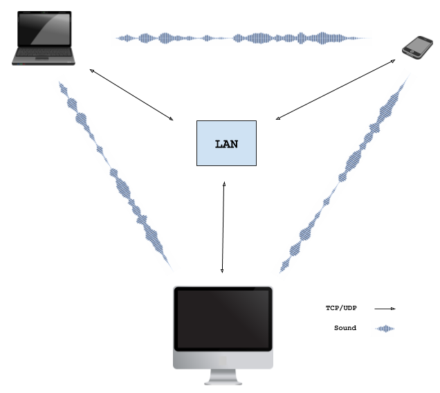

# wave-share

A proof-of-concept for WebRTC signaling using sound. Works with all devices that have microphone + speakers. Runs in the
browser.

Nearby devices negotiate the WebRTC connection by exchanging the necessary Session Description Protocol (SDP) data via
a sequence of audio tones. Upon successful negotiation, a local WebRTC connection is established between the browsers allowing data to be exchanged via LAN.

See it in action (2min video):

<a href="http://www.youtube.com/watch?feature=player_embedded&v=d30QDrKyQkg" target="_blank"></a>

Try it yourself: [ggerganov.github.io/wave-share](https://ggerganov.github.io/wave-share)

**Latest news:** \
I've extracted the data-over-sound algorithm into a standalone library called [ggwave](https://github.com/ggerganov/ggwave).\
It can be embedded easily into other projects.

## How it works

The [WebRTC](https://en.wikipedia.org/wiki/WebRTC) technology allows two browsers running on different devices to connect with each other and exchange data. There is no need to install plugins or download applications. To initiate the connection, the peers exchange contact information (ip address, network ports, session id, etc.). This process is called "signaling". The WebRTC specification does not define any standard for signaling - the contact exchange can be achieved by any protocol or technology.

In this project the signaling is performed via sound. The signaling sequence looks like this:

  - Peer A broadcasts an offer for a WebRTC connection by encoding the session data into audio tones
  - Nearby peer(s) capture the sound emitted by peer A and decode the WebRTC session data
  - Peer B, who wants to establish connection with peer A, responds with an audio answer. The answer has peer B's contact information encoded in it. Additionally, peer B starts trying to connect to peer A
  - Peer A receives the answer from peer B, decodes the transmitted contact data and allows peer B to connect
  - Connection is established
  
<p align="center"></p>
  
The described signaling sequence does not involve a signaling server. Therefore, an application using signaling through sound can be, for example, served by a static web page. The only requirement is to have control over the audio output/capture devices.

An obvious limitation (feature) of the current approach is that only nearby devices (e.g. within the same room) can establish connection with each other. Moreover, the devices have to be connected in the same local network, because NAT is not available.

## Sound Tx/Rx

The data communicated through sound contains the contact information required to initialize the WebRTC connection. This data is stored in the [Session Description Protocol (SDP)](https://en.wikipedia.org/wiki/Session_Description_Protocol) format. Since data-over-sound has significant limitations in terms of bandwidth and robustness it is desirable to transmit as few data as possible. Therefore, the SDP is stripped from all irrelevant information and only the essential data needed to establish the connection is transmitted. Currently, the sound packet containing the minimum required SDP data has the following format:

| Size, [B] | Description |
| --------- | ----------- |
| 1         | Type of the SDP - Offer or Answer |
| 1         | Packet size in bytes (not including ECC bytes) |
| 4         | IP address of the transmitting peer |
| 2         | Network port that will be used for the communication |
| 32        | SHA-256 fingerprint of the session data |
| 40        | ICE Credentials - 16 bytes username + 24 bytes password |
| 32        | ECC correction bytes used to correct errors during Tx |

The total size of the audio packet is 112 bytes. With the current audio encoding algorithm, the SDP packet can be transmitted in 5-10 seconds (depending on the Tx protocol used). Using slower protocols provides more reliable transmission in noisy environments or if the communicating devices are far from each other.

### Data-to-sound encoding

The current approach uses a multi-frequency [Frequency-Shift Keying (FSK)](https://en.wikipedia.org/wiki/Frequency-shift_keying) modulation scheme. The data to be transmitted is first split into 4-bit chunks. At each moment of time, 3 bytes are transmitted using 6 tones - one tone for each 4-bit chunk. The 6 tones are emitted in a 4.5kHz range divided in 96 equally-spaced frequencies:

| Freq, [Hz]   | Value, [bits]   | Freq, [Hz]   | Value, [bits]   | ... | Freq, [Hz]   | Value, [bits]   |
| ------------ | --------------- | ------------ | --------------- | --- | ------------ | --------------- |
| `F0 + 00*dF` | Chunk 0: `0000` | `F0 + 16*dF` | Chunk 1: `0000` | ... | `F0 + 80*dF` | Chunk 5: `0000` |
| `F0 + 01*dF` | Chunk 0: `0001` | `F0 + 17*dF` | Chunk 1: `0001` | ... | `F0 + 81*dF` | Chunk 5: `0001` |
| `F0 + 02*dF` | Chunk 0: `0010` | `F0 + 18*dF` | Chunk 1: `0010` | ... | `F0 + 82*dF` | Chunk 5: `0010` |
| ...          | ...             | ...          | ...             | ... | ...          | ...             |
| `F0 + 14*dF` | Chunk 0: `1110` | `F0 + 30*dF` | Chunk 1: `1110` | ... | `F0 + 94*dF` | Chunk 5: `1110` |
| `F0 + 15*dF` | Chunk 0: `1111` | `F0 + 31*dF` | Chunk 1: `1111` | ... | `F0 + 95*dF` | Chunk 5: `1111` |

For all protocols: `dF = 46.875 Hz`. For non-ultrasonic protocols: `F0 = 1875.000 Hz`. For ultrasonic protocols: `F0 = 15000.000 Hz`.

## Getting the local IP address

For convenience, a [simple WebRTC hack](https://github.com/diafygi/webrtc-ips) is used to automatically detect the local IP address of your machine, so you don't have to provide it manually. However, the latest WebRTC spec prevents this from being possible for security reasons, so at some point this "feature" will stop working in all browsers. For example, [it no longer works on Safari](https://stackoverflow.com/questions/46925857/get-the-client-ip-address-with-javascript-on-safari).

## Build

### Web Assembly module `wave.wasm`

You will need an Emscripten compiler. Run the ``compile.sh`` script.

### CLI tool `wave-share`

---

**Important:** This CLI tool was the prototype for the now standalone library [ggwave](https://github.com/ggerganov/ggwave). Make sure to check it out, as it has more up-to-date examples for the application of this data-over-sound type of communication.

---

This is a simple tool that receives and sends data using the explained `wave-share` sound tx/rx protocol. Type some text on the standard input and press Enter to transmit.

```bash
# build
git clone https://github.com/ggerganov/wave-share
cd wave-share && mkdir build && cd build
cmake ..
make

# running
./wave-share
```

Here is a short video demonstrating how to use the CLI tool:

<a href="http://www.youtube.com/watch?feature=player_embedded&v=TcfjCMCyqF0" target="_blank"></a>

## Known problems / stuff to improve

  - Does not work with: IE, IE Edge, Chrome/Firefox on iOS, Safari on macOS
  - Ultrasonic sound transmission does not work on most devices. Probably hardware limitations?
  - In presence of multiple local networks, cannot currently select which one to use. Always the first one is used
  - There is occasionally sound cracking during transmission. Need to optimize the Tx code
  - The size of the emscripten generated .js is too big (~1MB). Rewrite in pure JS?
  - On mobile, using Firefox, the page can remain running in the background even after closing the tab
